---
## Front matter
title: "Отчет по лабораторной работе №2"
subtitle: "Дисциплина архитектура компьютера"
author: "Ахатов Эмиль Эрнстович"

## Generic otions
lang: ru-RU
toc-title: "Содержание"

## Bibliography
bibliography: bib/cite.bib
csl: pandoc/csl/gost-r-7-0-5-2008-numeric.csl

## Pdf output format
toc: true # Table of contents
toc-depth: 2
lof: true # List of figures
lot: true # List of tables
fontsize: 12pt
linestretch: 1.5
papersize: a4
documentclass: scrreprt
## I18n polyglossia
polyglossia-lang:
  name: russian
  options:
	- spelling=modern
	- babelshorthands=true
polyglossia-otherlangs:
  name: english
## I18n babel
babel-lang: russian
babel-otherlangs: english
## Fonts
mainfont: IBM Plex Serif
romanfont: IBM Plex Serif
sansfont: IBM Plex Sans
monofont: IBM Plex Mono
mathfont: STIX Two Math
mainfontoptions: Ligatures=Common,Ligatures=TeX,Scale=0.94
romanfontoptions: Ligatures=Common,Ligatures=TeX,Scale=0.94
sansfontoptions: Ligatures=Common,Ligatures=TeX,Scale=MatchLowercase,Scale=0.94
monofontoptions: Scale=MatchLowercase,Scale=0.94,FakeStretch=0.9
mathfontoptions:
## Biblatex
biblatex: true
biblio-style: "gost-numeric"
biblatexoptions:
  - parentracker=true
  - backend=biber
  - hyperref=auto
  - language=auto
  - autolang=other*
  - citestyle=gost-numeric
## Pandoc-crossref LaTeX customization
figureTitle: "Рис."
tableTitle: "Таблица"
listingTitle: "Листинг"
lofTitle: "Список иллюстраций"
lotTitle: "Список таблиц"
lolTitle: "Листинги"
## Misc options
indent: true
header-includes:
  - \usepackage{indentfirst}
  - \usepackage{float} # keep figures where there are in the text
  - \floatplacement{figure}{H} # keep figures where there are in the text
---

# Цель работы

Целью работы является изучить идеологию и применение средств контроля
версий. Приобрести практические навыки по работе с системой git

# Задание

1. Настройка GitHub.
2. Базовая настройка Git.
3. Создание SSH-ключа.
4. Создание рабочего пространства и репозитория курса на основе шаблона.
5. Создание репозитория курса на основе шаблона.
6. Настройка каталога курса.
7. Выполнение заданий для самостоятельной работы.

# Теоретическое введение

Системы контроля версий (Version Control System, VCS) применяются при работе
нескольких человек над одним проектом. Обычно основное дерево проекта хранится
в локальном или удалённом репозитории, к которому настроен доступ для участников
проекта. При внесении изменений в содержание проекта система контроля версий
позволяет их фиксировать, совмещать изменения, произведённые разными участниками проекта,
производить откат к любой более ранней версии проекта, если это требуется.

В классических системах контроля версий используется централизованная модель,
предполагающая наличие единого репозитория для хранения файлов. Выполнение
большинства функций по управлению версиями осуществляется специальным сервером. Участник
проекта (пользователь) перед началом работы посредством определённых команд
получает нужную ему версию файлов. После внесения изменений, пользователь размещает
новую версию в хранилище. При этом предыдущие версии не удаляются из центрального
хранилища и к ним можно вернуться в любой момент. Сервер может сохранять не
полную версию изменённых файлов, а производить так называемую дельта-компрессию — сохранять
только изменения между последовательными версиями, что позволяет уменьшить объём хранимых данных.

Системы контроля версий поддерживают возможность отслеживания и разрешения
конфликтов, которые могут возникнуть при работе нескольких человек над одним
файлом. Можно объединить (слить) изменения, сделанные разными участниками
(автоматически или вручную), вручную выбрать нужную версию, отменить изменения вовсе или
заблокировать файлы для изменения. В зависимости от настроек блокировка не
позволяет другим пользователям получить рабочую копию или препятствует изменению рабочей копии
файла средствами файловой системы ОС, обеспечивая таким образом, привилегированный доступ
только одному пользователю, работающему с файлом.

Системы контроля версий также могут обеспечивать дополнительные, более гибкие
функциональные возможности. Например, они могут поддерживать работу с
несколькими версиями одного файла, сохраняя общую историю изменений до точки
ветвления версий и собственные истории изменений каждой ветви. Кроме того, обычно доступна
информация о том, кто из участников, когда и какие изменения вносил. Обычно такого рода
информация хранится в журнале изменений, доступ к которому можно ограничить.
В отличие от классических, в распределённых системах контроля версий центральный
репозиторий не является обязательным. Среди классических VCS наиболее известны CVS, Subversion, а среди
распределённых — Git, Bazaar, Mercurial. Принципы их работы схожи, отличаются они в основном
синтаксисом используемых в работе команд.

# Выполнение лабораторной работы

## Создание учетной записи Github.

Я создал учетную запись на Github,заполнил основные данные.

Описываются проведённые действия, в качестве иллюстрации даётся ссылка на иллюстрацию (рис. [-@fig:001]).

{#fig:001 width=70%}

Базовая настройка Git.
Открываю виртуальную машину, открываю терминал и делаю предварительную
конфигурацию git. Ввожу команду 
```bash
git config –global user.name ""
```
Указываю свое имя и команду `git config –global user.email "work@mail"`, указывая
в ней мою электронную почту.

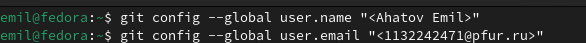{#fig:002 width=70%}

Настраиваю utf-8 в выводе сообщений git.

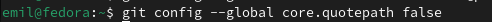{#fig:003 width=70%}

Задаю имя начальной ветки, параметр `autocrlf` со значением `input`, чтобы
конвертировать CRLF в L, параметр `safecrlf` со значением `warn`.

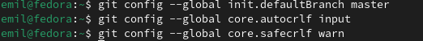{#fig:004 width=70%}

## Создание SSH-ключа

Для последующей идентификации пользователя на сервере репозиториев необходимо
сгенерировать пару ключей (приватный и открытый). Ввожу команду ssh-keygen -C
“Имя Фамилия, work@email”, указывая имя владельца и электронную почту
владельца. Ключ автоматически сохранится в каталоге ~/.ssh/.

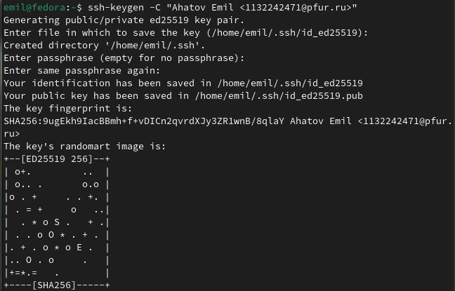{#fig:005 width=70%}

Открываю браузер, захожу на сайт GitHub. Открываю свой профиль и выбираю
страницу «SSH and GPG keys». Нажимаю кнопку «New SSH key». Вставляю
скопированный ключ в поле «Key». В поле Title указываю имя для ключа. Нажимаю
«Add SSH-key», чтобы завершить добавление ключа.

{#fig:006 width=70%}

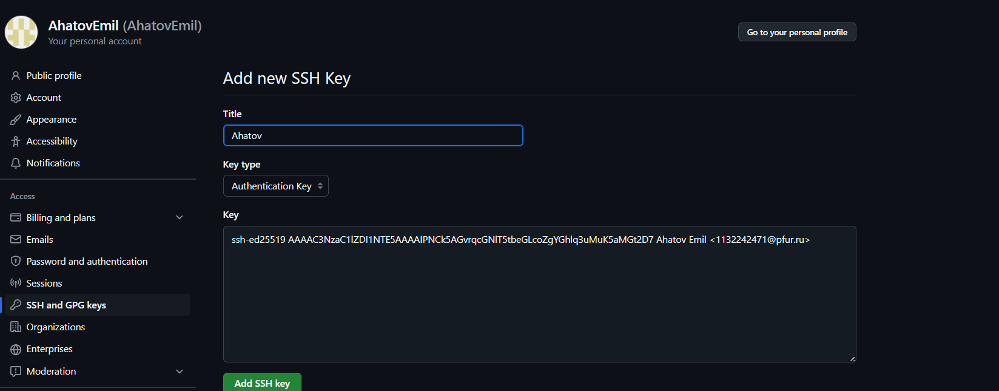{#fig:007 width=70%}

Создание рабочего пространства и репозитория курса на основе шаблона
Создаю директорию, рабочее пространство, с помощью утилиты mkdir, с помощью
ключа `-p` создаю все директории после домашней `~/work/study/2024-
2025/"Архитектура компьютера"`

{#fig:008 width=70%}

В браузере перехожу на страницу репозитория с шаблоном курса по адресу
`https://github.com/yamadharma/course-directory-student-template`. Далее выбираю
«Use this template», чтобы использовать этот шаблон для своего репозитория. В
открывшемся окне задаю имя репозитория (Repository name): study_2024–2025_arhpc
и создаю репозиторий, нажимаю на кнопку «Create repository from template».

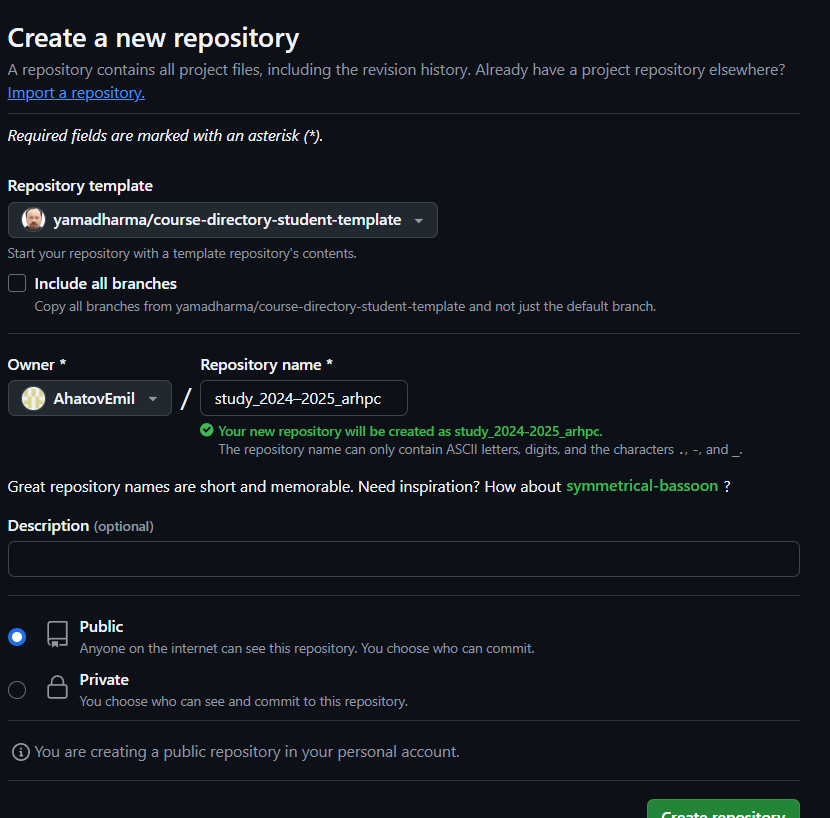{#fig:009 width=70%}

Клонирую созданный репозиторий с помощью команды git clone –recursive
git@github.com:/study_2024–2025_arh-pc.git arch-pc.

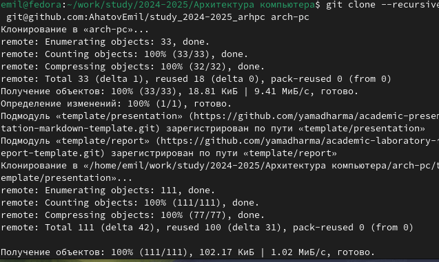{#fig:010 width=70%}

## Настройка каталога курса

Перехожу в каталог arch-pc с помощью утилиты cd, удаляю лишние файлы с помощью
утилиты rm.

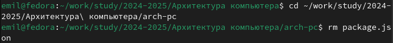{#fig:011 width=70%}

Создаю каталог, отправляю каталоги с локального репозитория

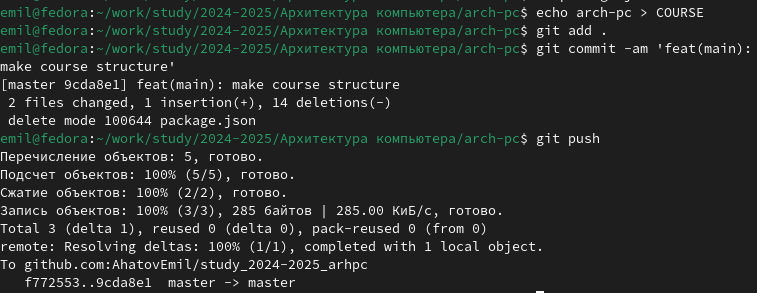{#fig:012 width=70%}

Проверка изменений на странице репозитория

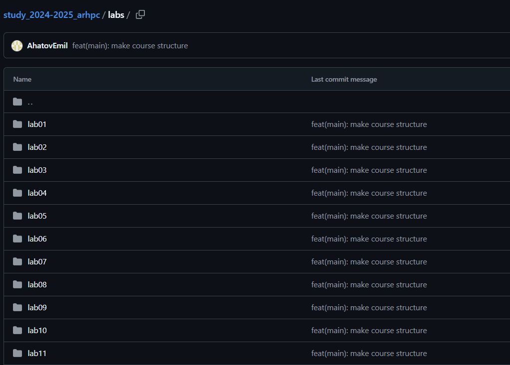{#fig:013 width=70%}

# Выполнение заданий для самостоятельной работы

Перехожу в директорию labs/lab03/report с помощью утилиты cd. Создаю в каталоге
файл для отчета по третьей лабораторной работе с помощью утилиты touch. Я
добавил отчет по предыдущей лабораторной работе в соответствующий каталог.

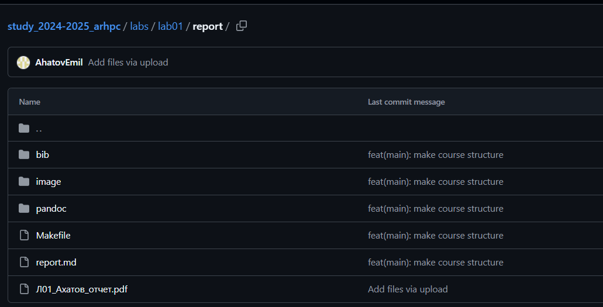{#fig:014 width=70%}


# Выводы

При выполнении данной лабораторной работы я изучила идеологию и применение
средств контроля версий, а также приобрела практические навыки по работе с
системой git.

# Вопросы для самопроверки

1. Системы контроля версий (VCS) — это программное обеспечение, которое помогает
отслеживать изменения в файловой системе и эффективно управлять версиями
файлов и кода в проекте. Они предназначены для решения следующих задач:
Отслеживание изменений: позволяет отслеживать все изменения, сделанные в файлах
проекта, включая добавление, удаление, изменение строк кода и текстовых данных.
Версионирование: сохраняет изменения в виде версий, что позволяет восстанавливать
предыдущие состояния проекта, откатывать изменения и переходить к определённым
версиям для просмотра или восстановления кода.
Ветвление и слияние (Branching and Merging): позволяет создавать отдельные ветки
проекта, где разработчики могут работать независимо, а затем объединять свои
изменения в основную ветку.
Работа в команде: позволяет нескольким разработчикам работать над одним проектом,
автоматически обнаруживая и решая конфликты при слиянии изменений.
История изменений: подробно записывает все изменения, включая информацию о
коммитах, авторах и времени внесения изменений.
2. Хранилище (репозиторий) — это специальное место, где хранятся файлы и папки
проекта. Изменения в этих файлах отслеживаются системой контроля версий (VCS).
Рабочая копия — это копия проекта, с которой разработчик работает напрямую. Он
вносит изменения в рабочую копию, а затем периодически синхронизирует её с
хранилищем.
Синхронизация включает
отправку изменений,
сделанных разработчиком, в хранилище (commit) и актуализацию рабочей копии с последней
версией из репозитория (update).
История — это последовательность всех изменений, которые были внесены в проект с
момента его создания. Она содержит информацию о том, кто, когда и какие изменения
внёс.
Таким образом, хранилище служит местом хранения проекта, рабочая копия —
инструментом для работы разработчика, а commit и update обеспечивают связь между
ними и сохранение истории изменений.
3. Централизованные VCS — это системы контроля версий, в которых репозиторий
проекта находится на сервере, доступ к которому осуществляется через клиентское
приложение. Примеры централизованных VCS: CVS (Concurrent Versions System) и
Subversion (SVN).
Децентрализованные VCS (также называемые распределёнными системами контроля
версий, DVCS) хранят копию репозитория у каждого разработчика, работающего с
системой. Локальные репозитории периодически синхронизируются с центральным
репозиторием. Примеры децентрализованных VCS: Git и Mercurial.
4. При единоличной работе с хранилищем в системе контроля версий (VCS)
12выполняются следующие действия:
Создание новой папки с датой или пометкой для рабочей версии проекта.
Копирование рабочей версии проекта в новую папку.
Непосредственная работа с рабочей копией проекта.
Периодическая синхронизация рабочей копии с репозиторием путём отправки
изменений (commit) и актуализации рабочей копии с последней версией из
репозитория (update).
5. Порядок работы с общим хранилищем VCS включает следующие этапы:
Создание репозитория: разработчик создаёт новый репозиторий, используя команды
git init, hg init или аналогичные в зависимости от используемой системы контроля
версий (например, Git, Mercurial).
Внесение изменений в файлы: разработчик вносит изменения в файлы проекта,
например, новые функции, исправления ошибок или другие изменения.
Добавление файлов: разработчик добавляет файлы проекта в список подготовленных
для сохранения в репозитории с помощью команды git add, hg add или аналогичной.
Коммит изменений: разработчик фиксирует изменения в файлах, создавая коммит с
помощью команды git commit, hg commit или аналогичной. В коммите указывается,
какие файлы были изменены, и краткое описание изменений.
Отправка изменений на сервер: разработчик отправляет изменения на сервер с
помощью команд git push, hg push или аналогичных.
6. Основные задачи, решаемые инструментальным средством Git:
Возврат к любой предыдущей версии кода.
Просмотр истории изменений.
Параллельная работа над проектом.
Backup кода. git clone — клонирование репозитория в новую директорию. git add — перенос
новых и изменённых файлов в проиндексированные. git push — отправка
закоммиченных файлов в удалённый репозиторий. git pull — извлечение и загрузка
последней информации в локальный репозиторий. git rm — удаление файла из
удалённого репозитория.
8. Вот несколько примеров использования локального репозитория:
Создание почтового аккаунта с использованием локального репозитория для хранения
данных.
Загрузка содержимого сайта с использованием локального репозитория и менеджера
файлов.
Настройка доступа к виртуальным папкам с помощью локального репозитория.
Управление базами данных приложений с использованием локального репозитория.
Примеры использования удалённого репозитория:
Разработка программного обеспечения в команде: разработчики могут совместно
работать над одним проектом, синхронизируя свои изменения с общим удалённым
репозиторием.
Хранение и обмен кодом: разработчики могут делиться своим кодом с другими
участниками команды или сообществом, загружая его в удалённый репозиторий.


