---
## Front matter
title: "Отчет по лабораторной работе №3 "
subtitle: "Дисциплина архитектура компьютера"
author: "Ахатов Эмиль Эрнстович"

## Generic otions
lang: ru-RU
toc-title: "Содержание"

## Bibliography
bibliography: bib/cite.bib
csl: pandoc/csl/gost-r-7-0-5-2008-numeric.csl

## Pdf output format
toc: true # Table of contents
toc-depth: 2
lof: true # List of figures
fontsize: 12pt
linestretch: 1.5
papersize: a4
documentclass: scrreprt
## I18n polyglossia
polyglossia-lang:
  name: russian
  options:
	- spelling=modern
	- babelshorthands=true
polyglossia-otherlangs:
  name: english
## I18n babel
babel-lang: russian
babel-otherlangs: english
## Fonts
mainfont: IBM Plex Serif
romanfont: IBM Plex Serif
sansfont: IBM Plex Sans
monofont: IBM Plex Mono
mathfont: STIX Two Math
mainfontoptions: Ligatures=Common,Ligatures=TeX,Scale=0.94
romanfontoptions: Ligatures=Common,Ligatures=TeX,Scale=0.94
sansfontoptions: Ligatures=Common,Ligatures=TeX,Scale=MatchLowercase,Scale=0.94
monofontoptions: Scale=MatchLowercase,Scale=0.94,FakeStretch=0.9
mathfontoptions:
## Biblatex
biblatex: true
biblio-style: "gost-numeric"
biblatexoptions:
  - parentracker=true
  - backend=biber
  - hyperref=auto
  - language=auto
  - autolang=other*
  - citestyle=gost-numeric
## Pandoc-crossref LaTeX customization
figureTitle: "Рис."
tableTitle: "Таблица"
listingTitle: "Листинг"
lofTitle: "Список иллюстраций"
lolTitle: "Листинги"
## Misc options
indent: true
header-includes:
  - \usepackage{indentfirst}
  - \usepackage{float} # keep figures where there are in the text
  - \floatplacement{figure}{H} # keep figures where there are in the text
---

# Цель работы

Целью данной лабораторной работы является освоение процедуры оформления отчетов с помощью легковесного языка разметки Markdown.

# Задание

1. Установка необходимого ПО
2. Заполнение отчета по выполнению лабораторной работы №4 с помощью
языка разметки Markdown
3. Задание для самостоятельной работы

# Теоретическое введение

Markdown - легковесный язык разметки, созданный с целью обозначения форматирования в простом тексте, с максимальным сохранением его читаемости
человеком, и пригодный для машинного преобразования в языки для продвинутых публикаций. Внутритекстовые формулы делаются аналогично формулам
LaTeX. В Markdown вставить изображение в документ можно с помощью непосредственного указания адреса изображения. Синтаксис Markdown для встроенной
ссылки состоит из части [link text], представляющей текст гиперссылки, и части (file-name.md) – URL-адреса или имени файла, на который дается ссылка.
Markdown поддерживает как встраивание фрагментов кода в предложение, так
и их размещение между предложениями в виде отдельных огражденных блоков. Огражденные блоки кода — это простой способ выделить синтаксис для
фрагментов кода.

# Выполнение лабораторной работы

## Установка утилит.

Скачал TexLive с офицального сайта, распаковал архив и установил при помощи скриптф install-tl-* с правами root, используя sudo в начале команды.

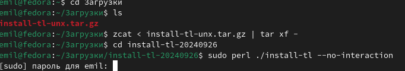{#fig:001 width=70%}

Скачиваю архив pandoc версии 2.18.

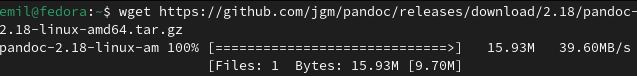{#fig:002 width=70%}

Cкачиваю crossref

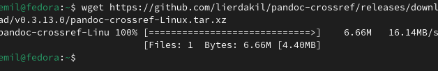{#fig:003 width=70%}

Распаковываю скачанные архивы, копирую файлы pandoc и pandoc-crossref в каталог /usr/local/bin/ с правами пользователя root с помощью sudo, проверяю корректность выполненных действий.

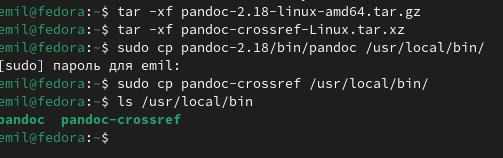{#fig:004 width=70%}

## Заполнение отчета по выполнению лабораторной работы №3 с помощью языка разметки Markdown

Открываю терминал. Перехожу в каталог курса, сформированный при выполненнии прошлой лаборатной работы, обновляю локальный репозиторий, скачав изменения из удаленного репозитория с помощью команды git pull.

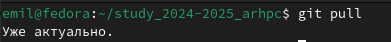{#fig:005 width=70%}

Перехожу в каталог с шаблоном отчета по лабораторной работе № 3, провожу компиляцию шаблона с использованием Makefile. Для этого ввожу команду make

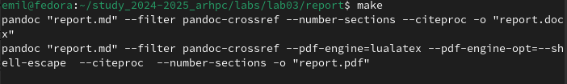{#fig:006 width=70%}

Открываю сгенерированный файл report.docx LibreOffice.

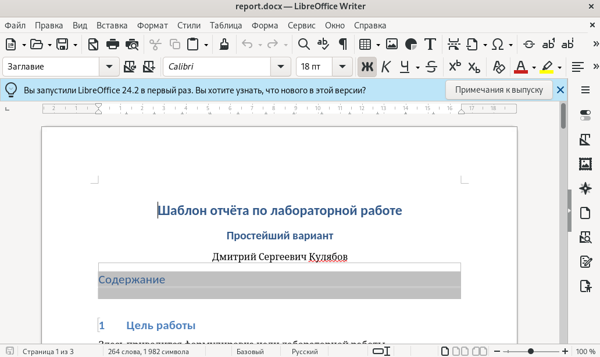{#fig:007 width=70%}

Открываю сгенерированный файл report.pdf, убедился, что все правильно сгенерировалось.

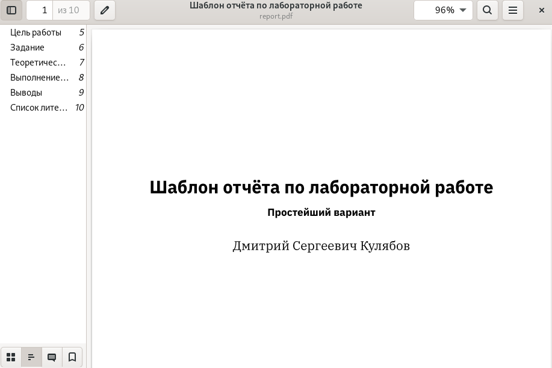{#fig:008 width=70%}

Удаляю полученные файлы с использованием Makefile, вводя команду make clean. С помощью команды ls проверяю, удалились ли созданные файлы

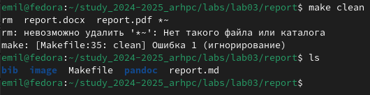{#fig:009 width=70%}

Открываю файл report.md

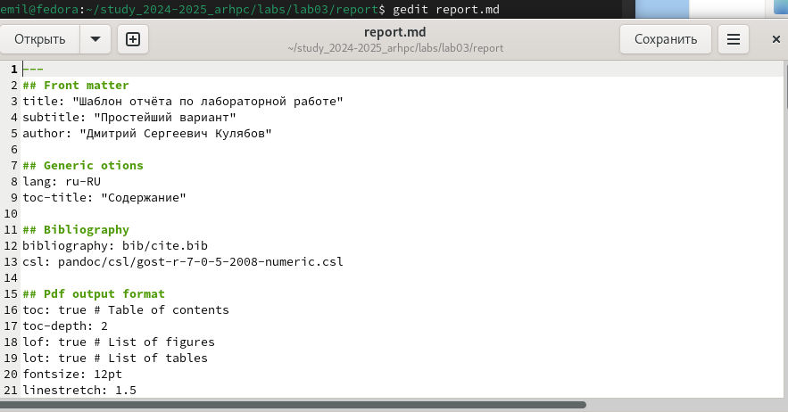{#fig:010 width=70%}

## Заполнение отчета

Начинаю заполнять отчет с помощью языка разметки Markdown в скопированном файле

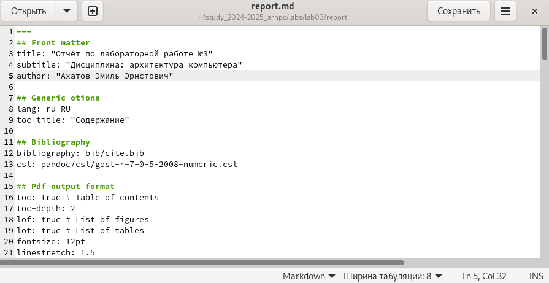{#fig:011 width=70%}

Компилирую файл с отчетом. Загружаю отчет на GitHub

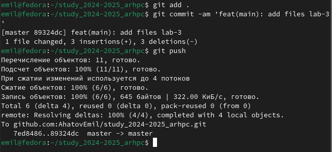{#fig:012 width=70%}

# Выполнение заданий для самостоятельной работы

Перехожу в директорию lab02/report с помощью cd, чтобы там заполнять отчет, копирую файл report.md с новым именем для заполненния отчета 

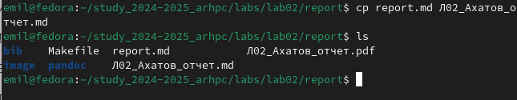{#fig:013 width=70%}

Заполняю отчет по лабораторной работе №2 при помощи языка разметки Markdown

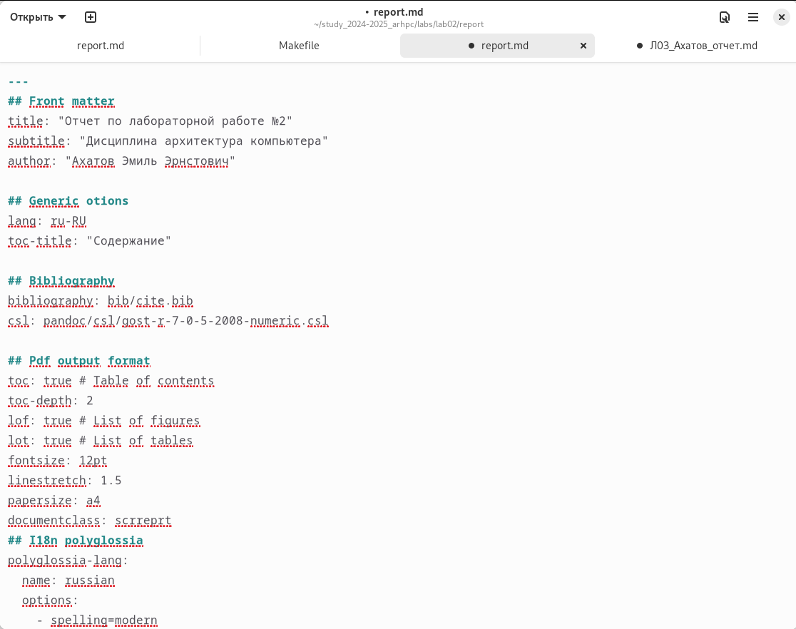{#fig:014 width=70%}

компилирую файл с отчетом по лабораторной работе,проверяю наличие файлов

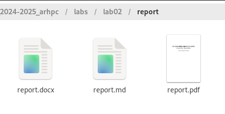{#fig:015 width=70%}

# Выводы

В результате выполнения данной лабораторной работы я освоил процедуры оформления отчетов с помощью легковесного языка разметки Markdown.

# Вопросы для самопроверки

1. Markdown — это язык разметки, который позволяет форматировать текст с помощью специальных символов и синтаксиса. Он был разработан для упрощения процесса создания и редактирования текстовых документов.
2. Курсив — используется символ «*» перед и после текста, который нужно выделить курсивом. Например: «Этот текст будет выделен курсивом».
Жирный шрифт — применяется символ «**» до и после фрагмента текста, который необходимо выделить жирным. Пример: «Этот текст станет жирным».
Зачёркнутый текст — обозначается символом «~» перед текстом, который требуется зачеркнуть. Например: ~этот текст будет зачёркнут~.
Моноширинный шрифт (для кода) — выделяется с помощью трёх обратных кавычек (`````) до и после блока кода или текста, который должен отображаться моноширинным шрифтом.
Цитата — оформляется с использованием символа «>» в начале строки. Например: > Это цитата.
3. В Markdown для оформления списков используются отступы и символы дефиса или звездочки.
Маркированный список оформляется с помощью символа дефиса
Нумерованный список создается с использованием символа цифры со знаком пробела
Списки со смешанной структурой оформляются с применением обоих символов
Каждый элемент списка начинается с новой строки и имеет дополнительный отступ по сравнению с предыдущим уровнем списка.
4. Для добавления изображений в Markdown используется синтаксис:!
Где ! — специальный символ, который указывает на то, что далее идёт изображение, а после него идёт ссылка на файл изображения.
Если изображение находится в том же каталоге, где и Markdown-файл, то можно указать только имя файла без пути:
5. Для написания математических формул в Markdown используется синтаксис LaTeX. Вот несколько примеров:
$E=mc^2$ — формула энергии Эйнштейна;
$$\int_a^bf(x)dx$$ — определённый интеграл функции f от a до b;
$e^{i\pi} + 1 = 0$ — формула, включающая комплексные числа.
Для того чтобы преобразовать формулу в вид, который можно отобразить на веб-странице, необходимо использовать онлайн-редакторы или расширения для текстовых редакторов, которые поддерживают Markdown и имеют функцию преобразования формул.
Чтобы создать ссылку на формулу, используйте следующий синтаксис:
[Текст ссылки][1]
1: $E=mc^2$, где «Текст ссылки» — это текст, который будет отображаться при клике на ссылку, а $E=mc^2$ — сама формула.
