---
## Front matter
title: "Отчет по лабораторной работе №5 "
subtitle: "Дисциплина архитектура компьютера"
author: "Ахатов Эмиль Эрнстович"

## Generic otions
lang: ru-RU
toc-title: "Содержание"

## Bibliography
bibliography: bib/cite.bib
csl: pandoc/csl/gost-r-7-0-5-2008-numeric.csl

## Pdf output format
toc: true # Table of contents
toc-depth: 2
lof: true # List of figures
fontsize: 12pt
linestretch: 1.5
papersize: a4
documentclass: scrreprt
## I18n polyglossia
polyglossia-lang:
  name: russian
  options:
	- spelling=modern
	- babelshorthands=true
polyglossia-otherlangs:
  name: english
## I18n babel
babel-lang: russian
babel-otherlangs: english
## Fonts
mainfont: IBM Plex Serif
romanfont: IBM Plex Serif
sansfont: IBM Plex Sans
monofont: IBM Plex Mono
mathfont: STIX Two Math
mainfontoptions: Ligatures=Common,Ligatures=TeX,Scale=0.94
romanfontoptions: Ligatures=Common,Ligatures=TeX,Scale=0.94
sansfontoptions: Ligatures=Common,Ligatures=TeX,Scale=MatchLowercase,Scale=0.94
monofontoptions: Scale=MatchLowercase,Scale=0.94,FakeStretch=0.9
mathfontoptions:
## Biblatex
biblatex: true
biblio-style: "gost-numeric"
biblatexoptions:
  - parentracker=true
  - backend=biber
  - hyperref=auto
  - language=auto
  - autolang=other*
  - citestyle=gost-numeric
## Pandoc-crossref LaTeX customization
figureTitle: "Рис."
tableTitle: "Таблица"
listingTitle: "Листинг"
lofTitle: "Список иллюстраций"
lolTitle: "Листинги"
## Misc options
indent: true
header-includes:
  - \usepackage{indentfirst}
  - \usepackage{float} # keep figures where there are in the text
  - \floatplacement{figure}{H} # keep figures where there are in the text
---

# Цель работы

Целью данной лабораторной работы является приобретение практических
навыков работы в Midnight Commander, освоение инструкций языка ассемблера
mov и int

# Задание

1. Основы работы с mc
2. Структура программы на языке ассемблера NASM
3. Подключение внешнего файла
4. Выполнение заданий для самостоятельной работы

# Теоретическое введение

Midnight Commander (или просто mc) — это программа, которая позволяет
просматривать структуру каталогов и выполнять основные операции по управ-
лению файловой системой, т.е. mc является файловым менеджером. Midnight
Commander позволяет сделать работу с файлами более удобной и наглядной. Про-
грамма на языке ассемблера NASM, как правило, состоит из трёх секций: секция
кода программы (SECTION .text), секция инициированных (известных во время
компиляции) данных (SECTION .data) и секция неинициализированных данных
(тех, под которые во время компиляции только отводится память, а значение
присваивается в ходе выполнения программы) (SECTION .bss). Для объявления
инициированных данных в секции .data используются директивы DB, DW, DD,
DQ и DT, которые резервируют память и указывают, какие значения должны
храниться в этой памяти: - DB (define byte) — определяет переменную разме-
ром в 1 байт; - DW (define word) — определяет переменную размеров в 2 байта
(слово); - DD (define double word) — определяет переменную размером в 4 байта
(двойное слово); - DQ (define quad word) — определяет переменную размером в
8 байт (учетве- рённое слово); - DT (define ten bytes) — определяет переменную
размером в 10 байт. Директивы используются для объявления простых перемен-
ных и для объявления массивов. Для определения строк принято использовать
директиву DB в связи с особенностями хранения данных в оперативной памяти.
Инструкция языка ассемблера mov предназначена для дублирования данных
источника в приёмнике.
mov dst,src
Здесь операнд dst — приёмник, а src — источник. В качестве операнда могут
выступать регистры (register), ячейки памяти (memory) и непосредственные
значения (const). Инструкция языка ассемблера intпредназначена для вызова
прерывания с указанным номером.
int n
Здесь n — номер прерывания, принадлежащий диапазону 0–255. При програм-
мировании в Linux с использованием вызовов ядра sys_calls n=80h (принято
задавать в шестнадцатеричной системе счисления)

# Выполнение лабораторной работы

## Основы работы с mc

Открываю Midnight Commander, введя в терминал mc

{#fig:001 width=70%}

Перехожу в каталог ~/work/study/2023-2024/Архитектура Компьютера/arch-pc

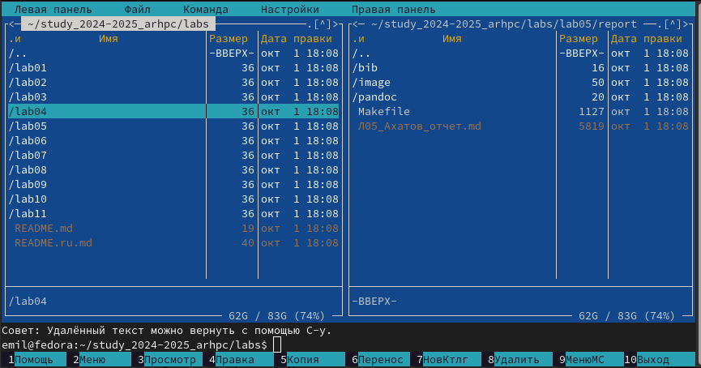{#fig:002 width=70%}

С помощью клавиши F7 создаю каталог lab05

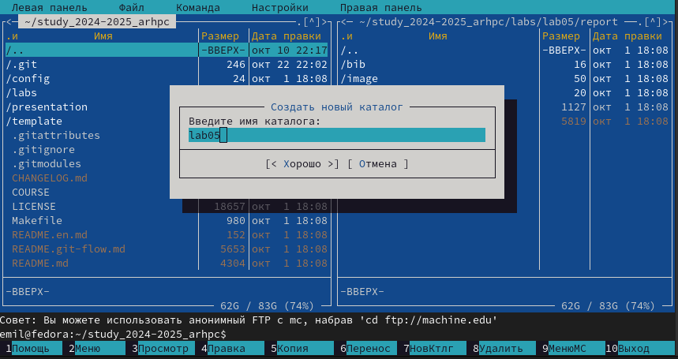{#fig:003 width=70%}

Перехожу в созданный каталог,в строке ввода прописываю команду touch lab05-1.asm, чтобы создать файл

{#fig:004 width=70%}

## Структура программы на языке ассемблера NASM

Превращаю текст программы для вывода “Hello world!” в объектный код с
помощью транслятора NASM, используя команду nasm -f elf hello.asm, ключ -f
указывает транслятору nasm, что требуется создать бинарный файл в формате
ELF (рис. 4.5). Далее проверяю правильность выполнения команды с помощью
утилиты ls: действительно, создан файл “hello.o”

## Работа с расширенным синтаксисом командной строки NASM

С помощью функциональной клавиши F4 открываю файл lab5-1.asm для редактирования во встроенном редакторе.

{#fig:005 width=70%}

Ввожу в файл код программы для запроса строки у пользователя

{#fig:006 width=70%}

выхожу из файла (Ctrl+X), сохраняя изменения (Y, Enter).
Открыл файл и убедился,что файл содержит текст программы.
Транслирую текст программы файла в объектный файл командой nasm -f elf
lab5-1.asm.Создался объектный файл lab5-1.o. Выполняю компоновку объектного
файла с помощью команды ld -m elf_i386 -o lab5-1 lab5-1.o. Создался
исполняемый файл lab5-1.

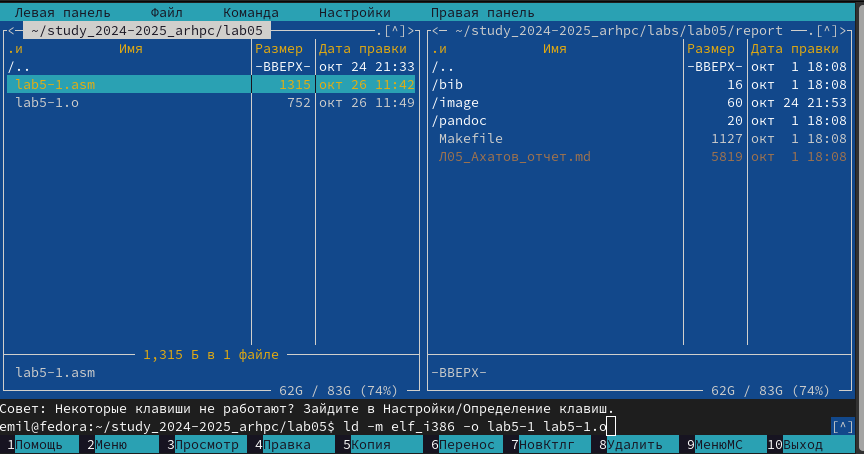{#fig:007 width=70%}

Запускаю исполняемый файл. Программа выводит строку “Введите строку:”
и ждет ввода с клавиатуры, я ввожу свои ФИО, на этом программа заканчивает
свою работу

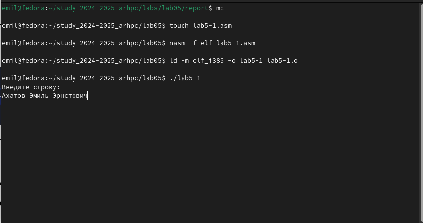{#fig:008 width=70%}

##Подключение внешнего файла

Скачиваю файл in_out.asm со страницы курса в ТУИС.

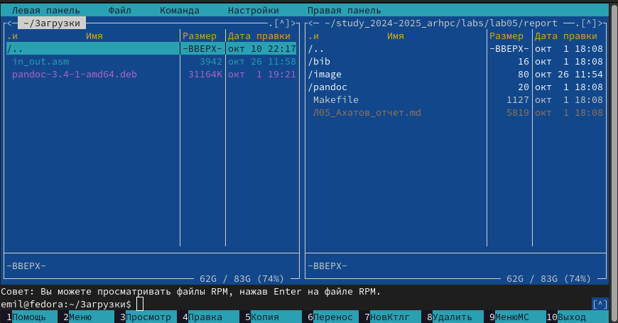{#fig:009 width=70%}

Копирую файл in_out.asm из каталога
Загрузки в созданный каталог lab05

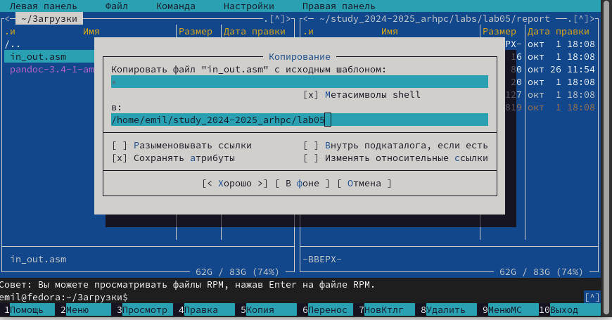{#fig:010 width=70%}

С помощью функциональной клавиши F5 копирую файл lab5-1 в тот же каталог,
но с другим именем, для этого в появившемся окне mc прописываю имя для
копии файла

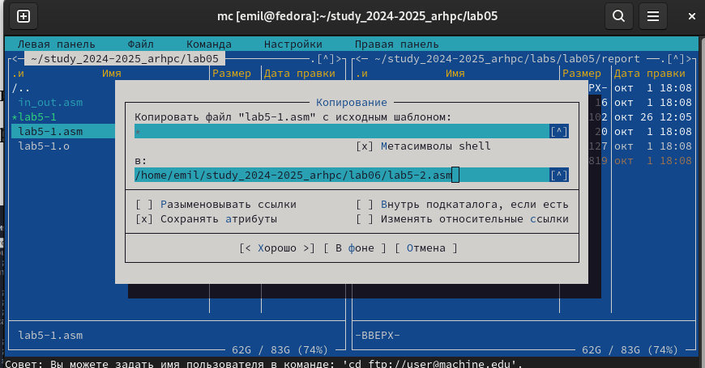{#fig:011 width=70%}

Изменяю содержимое файла lab5-2.asm во встроенном редакторе nano, чтобы в программе использовались подпрограммы из внешнего файла in_out.asm.

{#fig:012 width=70%}

Транслирую текст программы файла в объектный файл командой nasm -f elf
lab5-2.asm. Создался объектный файл lab5-2.o. Выполняю компоновку объектного
файла с помощью команды ld -m elf_i386 -o lab5-2 lab5-2.o Создался исполняемый
файл lab5-2. Запускаю исполняемый файл.

{#fig:013 width=70%}

Открываю файл lab5-2.asm для редактирования в nano. Изменяю в нем подпрограмму sprintLF на sprint. Сохраняю изменения
и открываю файл для просмотра, чтобы проверить сохранение действий

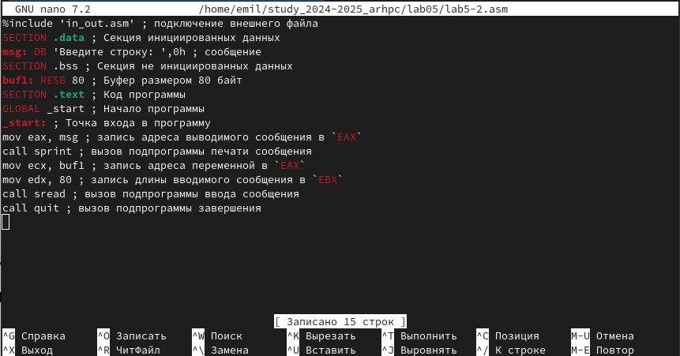{#fig:014 width=70%}

Снова транслирую файл, выполняю компоновку созданного объектного файла,
запускаю новый исполняемый файл

{#fig:015 width=70%}

Разница между первым исполняемым файлом и вторым в том,
что запуск первого запрашивает ввод с новой строки, а программа, которая
исполняется при запуске второго, запрашивает ввод без переноса на новую
строку, потому что в этом заключается различие между подпрограммами sprintLF
и sprint.

#Выполнение заданий для самостоятельной работы

Создаю копию файла lab5-1.asm с именем lab5-1-1.asm.
открываю созданный файл для редактирования. Изменяю программу так, чтобы кроме вывода приглашения и
запроса ввода, она выводила вводимую пользователем строку.

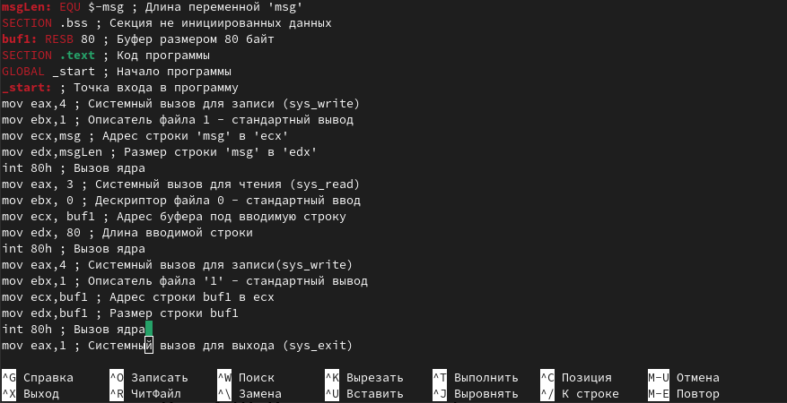{#fig:016 width=70%}

Создаю объектный файл lab5-1-1.o, отдаю его на обработку компоновщику,
получаю исполняемый файл lab5-1-1, запускаю полученный исполняемый
файл. Программа запрашивает ввод, ввожу свои ФИО, далее программа
выводит введенные мною данные.

{#fig:017 width=70%}

Создаю копию файла lab5-2.asm с именем lab5-2-1.asm

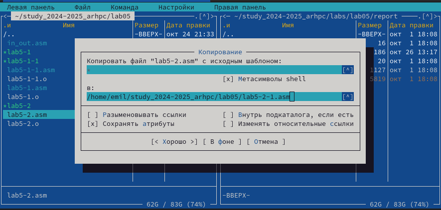{#fig:018 width=70%}

Открываю созданный файл для редактирования. Изменяю программу так, чтобы кроме вывода приглашения и
запроса ввода, она выводила вводимую пользователем строку.

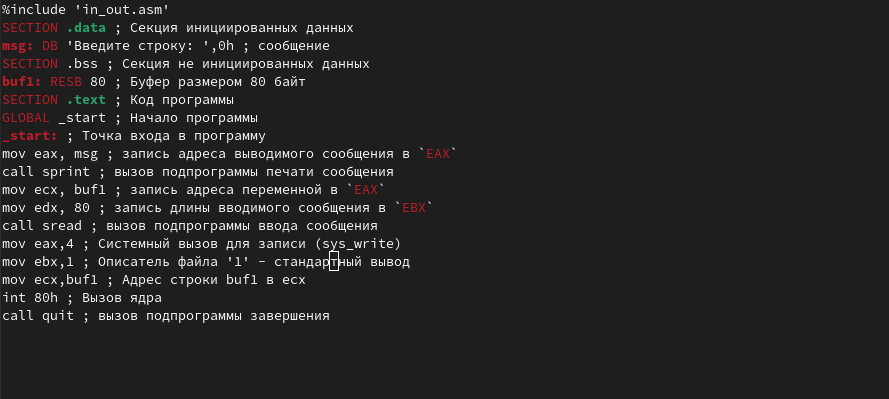{#fig:019 width=70%}

Создаю объектный файл lab5-2-1.o, отдаю его на обработку компоновщику,
получаю исполняемый файл lab5-2-1, запускаю полученный исполняемый
файл. Программа запрашивает ввод без переноса на новую строку, ввожу
свои ФИО, далее программа выводит введенные мною данные

{#fig:020 width=70%}

# Выводы

При выполнении данной лабораторной работы я приобрел практические
навыки работы в Midnight Commander, а также освоил инструкции языка ассемблера mov и int.
