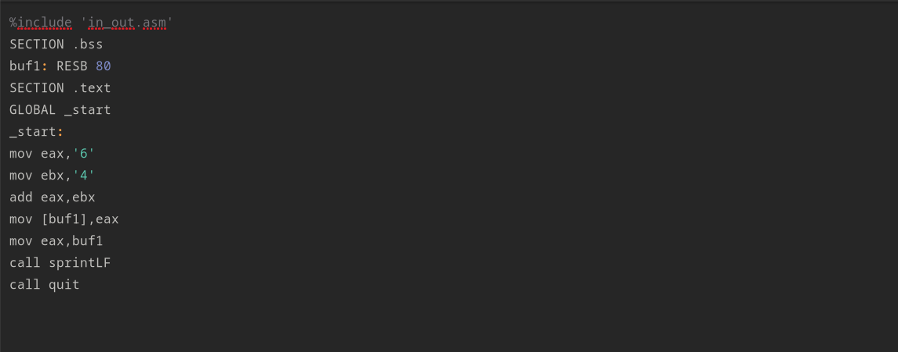
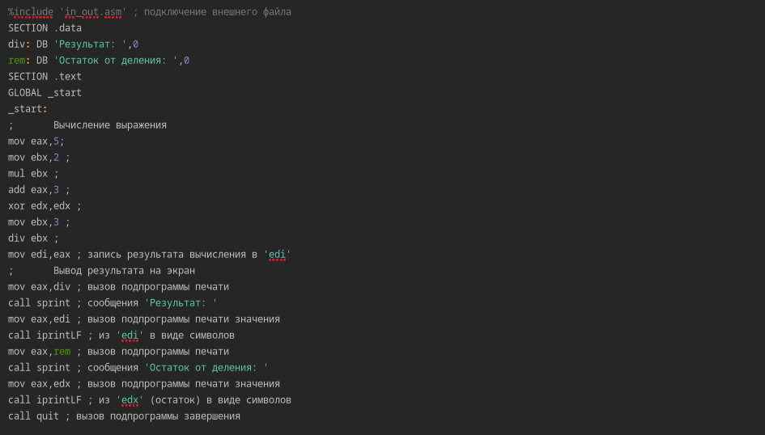
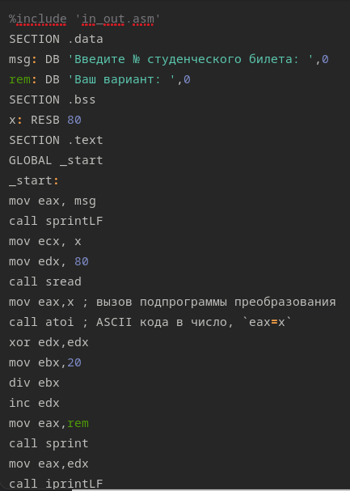
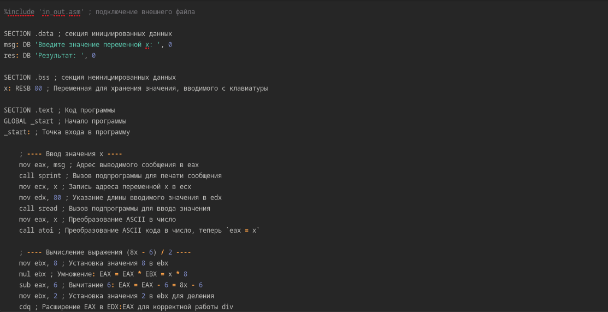

---
## Front matter
title: "Отчет по лабораторной работе №6 "
subtitle: "Дисциплина архитектура компьютера"
author: "Ахатов Эмиль Эрнстович"

## Generic otions
lang: ru-RU
toc-title: "Содержание"

## Bibliography
bibliography: bib/cite.bib
csl: pandoc/csl/gost-r-7-0-5-2008-numeric.csl

## Pdf output format
toc: true # Table of contents
toc-depth: 2
lof: true # List of figures
fontsize: 12pt
linestretch: 1.5
papersize: a4
documentclass: scrreprt
## I18n polyglossia
polyglossia-lang:
  name: russian
  options:
	- spelling=modern
	- babelshorthands=true
polyglossia-otherlangs:
  name: english
## I18n babel
babel-lang: russian
babel-otherlangs: english
## Fonts
mainfont: IBM Plex Serif
romanfont: IBM Plex Serif
sansfont: IBM Plex Sans
monofont: IBM Plex Mono
mathfont: STIX Two Math
mainfontoptions: Ligatures=Common,Ligatures=TeX,Scale=0.94
romanfontoptions: Ligatures=Common,Ligatures=TeX,Scale=0.94
sansfontoptions: Ligatures=Common,Ligatures=TeX,Scale=MatchLowercase,Scale=0.94
monofontoptions: Scale=MatchLowercase,Scale=0.94,FakeStretch=0.9
mathfontoptions:
## Biblatex
biblatex: true
biblio-style: "gost-numeric"
biblatexoptions:
  - parentracker=true
  - backend=biber
  - hyperref=auto
  - language=auto
  - autolang=other*
  - citestyle=gost-numeric
## Pandoc-crossref LaTeX customization
figureTitle: "Рис."
tableTitle: "Таблица"
listingTitle: "Листинг"
lofTitle: "Список иллюстраций"
lolTitle: "Листинги"
## Misc options
indent: true
header-includes:
  - \usepackage{indentfirst}
  - \usepackage{float} # keep figures where there are in the text
  - \floatplacement{figure}{H} # keep figures where there are in the text
---

# Цель работы

Освоение арифметических инструкций языка ассемблера NASM.

# Задание

1. Символьные и численные данные в NASM
2. Выполнение арифметических операций в NASM
3. Выполнение заданий для самостоятельной работы

# Теоретическое введение

Большинство инструкций на языке ассемблера требуют обработки операндов.
Адрес операнда предоставляет место, где хранятся данные, подлежащие обра-
ботке. Это могут быть данные хранящиеся в регистре или в ячейке памяти. -
Регистровая адресация – операнды хранятся в регистрах и в команде использу-
ются имена этих регистров, например: mov ax,bx. - Непосредственная адресация
– значение операнда задается непосредственно в команде, Например: mov ax,2.
- Адресация памяти – операнд задает адрес в памяти. В команде указывается
символическое обозначение ячейки памяти, над содержимым которой требуется
выполнить операцию.
Ввод информации с клавиатуры и вывод её на экран осуществляется в символь-
ном виде. Кодирование этой информации производится согласно кодовой табли-
це символов ASCII. ASCII – сокращение от American Standard Code for Information
Interchange (Американский стандартный код для обмена информацией). Соглас-
но стандарту ASCII каждый символ кодируется одним байтом. Среди инструкций
NASM нет такой, которая выводит числа (не в символьном виде). Поэтому, на-
пример, чтобы вывести число, надо предварительно преобразовать его цифры в
ASCII-коды этих цифр и выводить на экран эти коды, а не само число. Если же
выводить число на экран непосредственно, то экран воспримет его не как число,
а как последовательность ASCII-символов – каждый байт числа будет воспринят
как один ASCII-символ – и выведет на экран эти символы. Аналогичная ситу-
ация происходит и при вводе данных с клавиатуры. Введенные данные будут
представлять собой символы, что сделает невозможным получение корректного
результата при выполнении над ними арифметических операций. Для решения
этой проблемы необходимо проводить преобразование ASCII символов в числа
и обратно

# Выполнение лабораторной работы

## Символьные и численные данные в NASM

С помощью утилиты mkdir создаю директорию, в которой буду создавать файлы с программами,перехожу в директорию.

{#fig:001 width=70%}

С помощью утилиты touch создаю файл lab6-1.asm

{#fig:002 width=70%}

Открываю созданный файл lab6-1.asm, вставляю в него программу вывода значения регистра eax

{#fig:003 width=70%}

Создаю исполняемый файл программы и запускаю его. Вывод программы: символ j, потому что программа вывела символ, соответствующий по системе ASCII сумме двоичных кодов символов 4 и 6.

{#fig:004 width=70%}

Изменяю в тексте программы символы “6” и “4” на цифры 6 и 4

{#fig:005 width=70%}

Создаю новый исполняемый файл программы и запускаю его. Теперь вывелся символ с кодом 10, это символ перевода строки, этот символ не отображается при выводе на экран.

{#fig:006 width=70%}

Создаю новый файл lab6-2.asm с помощью утилиты touch.

{#fig:007 width=70%}

Ввожу в файл текст другой программы для вывода значения регистра eax

{#fig:008 width=70%}

Создаю и запускаю исполняемый файл lab6-2. Теперь вывод числа
106,программа позволяет вывести именно число, а не символ, хотя
все еще происходит именно сложение кодов символов “6” и “4”.

{#fig:009 width=70%}

Заменяю в тексте программы в файле lab6-2.asm символы “6” и “4” на числа 6
и 4

{#fig:010 width=70%}

Создаю и запускаю новый исполняемый файл. Теперь программа складывает не соответствующие символам коды в системе ASCII, а сами числа, поэтому вывод 10.

{#fig:011 width=70%}

Заменяю в тексте программы функцию iprintLF на iprint 

{#fig:012 width=70%}

Создаю и запускаю новый исполняемый файл. Вывод не изменился,потому что символ переноса строки не отображался, когда программа исполнялась с функцией iprintLF, а iprint не добавляет к выводу символ переноса строки,
в отличие от iprintLF.

{#fig:013 width=70%}

## Выполнение арифметических операций в NASM

Создаю файл lab6-3.asm с помощью утилиты touch

{#fig:014 width=70%}

Ввожу в созданный файл текст программы для вычисления значения выражения f(x) = (5 * 2 + 3)/3 

{#fig:015 width=70%}

Создаю исполняемый файл и запускаю его

{#fig:016 width=70%}

Изменяю программу так, чтобы она вычисляла значение выражения f(x) = (4 * 6 + 2)/5 

{#fig:017 width=70%}

Создаю и запускаю новый исполняемый файл,программа выполняется верно

{#fig:018 width=70%}

Создаю файл variant.asm с помощью утилиты touch.

{#fig:019 width=70%}

Ввожу в файл текст программы для вычисления варианта задания по номеру
студенческого билета

{#fig:020 width=70%}

Создаю и запускаю исполняемый файл. Ввожу номер своего студ. билета с клавиатуры, программа вывела, что мой вариант - 12

{#fig:021 width=70%}

## Ответы на вопросы по программе

1. За вывод сообщения "Ваш вариант" отвечают строки кода:

```NASM
mov eax,rem
call sprint
```
2. Инструкция mov ecx, x используется, чтобы положить адрес вводимой строки x в регистр ecx
mov edx, 80 - запись в регистр edx длины вводимой строки 
call sread - вызов подпрограммы из внешнего файла, обеспечивающей ввод сообщения с клавиатуры  

3. call atoi используется для вызова подпрограммы из внешнего файла, которая преобразует ascii-код символа в целое число и записывает результат в регистр eax

4. За вычисления варианта отвечают строки:

```NASM
xor edx,edx ; обнуление edx для корректной работы div
mov ebx,20 ; ebx = 20
div ebx ; eax = eax/20, edx - остаток от деления
inc edx ; edx = edx + 1
```

5. При выполнении инструкции div ebx остаток от деления записывается в регистр edx

6. Инструкция inc edx увеличивает значение регистра edx на 1

7. За вывод на экран результатов вычислений отвечают строки:

```NASM
mov eax,edx
call iprintLF
```

#Выполнение заданий для самостоятельной работы

Создаю файл lab6-4.asm с помощью утилиты touch

{#fig:022 width=70%}

Открываю созданный файл для редактирования, ввожу в него текст программы для вычисления значения выражения (8𝑥 − 6)/2 

{#fig:023 width=70%}

Создаю и запускаю исполняемый файл, при вводе значения 1, вывод 1.При вводе значения 5, вывод 17.Программа отработала верно.

# Выводы

При выполнении данной лабораторной работы я освоил арифметические инструкции языка ассемблера NASM.

