---
## Front matter
title: "Отчет по лабораторной работе №9 "
subtitle: "Дисциплина архитектура компьютера"
author: "Ахатов Эмиль Эрнстович"

## Generic otions
lang: ru-RU
toc-title: "Содержание"

## Bibliography
bibliography: bib/cite.bib
csl: pandoc/csl/gost-r-7-0-5-2008-numeric.csl

## Pdf output format
toc: true # Table of contents
toc-depth: 2
lof: true # List of figures
fontsize: 12pt
linestretch: 1.5
papersize: a4
documentclass: scrreprt
## I18n polyglossia
polyglossia-lang:
  name: russian
  options:
	- spelling=modern
	- babelshorthands=true
polyglossia-otherlangs:
  name: english
## I18n babel
babel-lang: russian
babel-otherlangs: english
## Fonts
mainfont: IBM Plex Serif
romanfont: IBM Plex Serif
sansfont: IBM Plex Sans
monofont: IBM Plex Mono
mathfont: STIX Two Math
mainfontoptions: Ligatures=Common,Ligatures=TeX,Scale=0.94
romanfontoptions: Ligatures=Common,Ligatures=TeX,Scale=0.94
sansfontoptions: Ligatures=Common,Ligatures=TeX,Scale=MatchLowercase,Scale=0.94
monofontoptions: Scale=MatchLowercase,Scale=0.94,FakeStretch=0.9
mathfontoptions:
## Biblatex
biblatex: true
biblio-style: "gost-numeric"
biblatexoptions:
  - parentracker=true
  - backend=biber
  - hyperref=auto
  - language=auto
  - autolang=other*
  - citestyle=gost-numeric
## Pandoc-crossref LaTeX customization
figureTitle: "Рис."
tableTitle: "Таблица"
listingTitle: "Листинг"
lofTitle: "Список иллюстраций"
lolTitle: "Листинги"
## Misc options
indent: true
header-includes:
  - \usepackage{indentfirst}
  - \usepackage{float} # keep figures where there are in the text
  - \floatplacement{figure}{H} # keep figures where there are in the text
---

# Цель работы

Приобретение навыков написания программ с использованием подпрограмм. Знакомство
с методами отладки при помощи GDB и его основными возможностями

# Задание

1. Программа с вызовом подпрограммы
2. Изменение программы с применением инструкции ret и call
3. Отладка программ с помощью GDB
4. Добавление точек останова
5. Работа с данными программами в GDB
6. Обработка аргументов командной сроки в GDB
7. Выполнение заданий для самостоятельной работы

# Теоретическое введение

Понятие об отладке
Отладка — это процесс поиска и исправления ошибок в программе. В общем случае его
можно разделить на четыре этапа:

• обнаружение ошибки;
• поиск её местонахождения;
• определение причины ошибки;
• исправление ошибки.
Можно выделить следующие типы ошибок:

• синтаксические ошибки — обнаруживаются во время трансляции исходного кода и
вызваны нарушением ожидаемой формы или структуры языка;
• семантические ошибки — являются логическими и приводят к тому, что программа
запускается, отрабатывает, но не даёт желаемого результата;
• ошибки в процессе выполнения — не обнаруживаются при трансляции и вызывают пре-
рывание выполнения программы (например, это ошибки, связанные с переполнением
или делением на ноль).

Второй этап — поиск местонахождения ошибки. Некоторые ошибки обнаружить доволь-
но трудно. Лучший способ найти место в программе, где находится ошибка, это разбить
программу на части и произвести их отладку отдельно друг от друга.
Третий этап — выяснение причины ошибки. После определения местонахождения ошибки
обычно проще определить причину неправильной работы программы.
Последний этап — исправление ошибки. После этого при повторном запуске программы,
может обнаружиться следующая ошибка, и процесс отладки начнётся заново

Методы отладки
Наиболее часто применяют следующие методы отладки:

• создание точек контроля значений на входе и выходе участка программы (например,
вывод промежуточных значений на экран — так называемые диагностические сообщения);
• использование специальных программ-отладчиков.

Отладчики позволяют управлять ходом выполнения программы, контролировать и из-
менять данные. Это помогает быстрее найти место ошибки в программе и ускорить её
исправление. Наиболее популярные способы работы с отладчиком — это использование
точек останова и выполнение программы по шагам.
Пошаговое выполнение — это выполнение программы с остановкой после каждой строчки,
чтобы программист мог проверить значения переменных и выполнить другие действия.
Точки останова — это специально отмеченные места в программе, в которых программа-
отладчик приостанавливает выполнение программы и ждёт команд. Наиболее популярные
виды точек останова:

• Breakpoint — точка останова (остановка происходит, когда выполнение доходит до
определённой строки, адреса или процедуры, отмеченной программистом);
• Watchpoint — точка просмотра (выполнение программы приостанавливается, если
программа обратилась к определённой переменной: либо считала её значение, либо
изменила его).

Точки останова устанавливаются в отладчике на время сеанса работы с кодом програм-
мы, т.е. они сохраняются до выхода из программы-отладчика или до смены отлаживаемой
программы

Основные возможности отладчика GDB

GDB (GNU Debugger — отладчик проекта GNU) [1] работает на многих UNIX-подобных
системах и умеет производить отладку многих языков программирования. GDB предлагает
обширные средства для слежения и контроля за выполнением компьютерных программ. От-
ладчик не содержит собственного графического пользовательского интерфейса и использует
стандартный текстовый интерфейс консоли. Однако для GDB существует несколько сторон-
них графических надстроек, а кроме того, некоторые интегрированные среды разработки
используют его в качестве базовой подсистемы отладки.
Отладчик GDB (как и любой другой отладчик) позволяет увидеть, что происходит «внутри»
программы в момент её выполнения или что делает программа в момент сбоя.
GDB может выполнять следующие действия:

• начать выполнение программы, задав всё, что может повлиять на её поведение;
• остановить программу при указанных условиях;
• исследовать, что случилось, когда программа остановилась;
• изменить программу так, чтобы можно было поэкспериментировать с устранением эффектов одной ошибки и продолжить выявление других.

Запуск отладчика GDB; выполнение программы; выход
Синтаксис команды для запуска отладчика имеет следующий вид:
gdb [опции] [имя_файла | ID процесса]
После запуска gdb выводит текстовое сообщение — так называемое «nice GDB logo». В
следующей строке появляется приглашение (gdb) для ввода команд.
Далее приведён список некоторых команд GDB.
Команда run (сокращённо r) — запускает отлаживаемую программу в оболочке GDB.
Если точки останова не были установлены, то программа выполняется и выводятся сообщения:

(gdb) run
Starting program: test
Program exited normally.
(gdb)

Если точки останова были заданы, то отладчик останавливается на соответствующей
команде и выдаёт номер точки останова, адрес и дополнительную информацию — текущую
строку, имя процедуры, и др.
Команда kill (сокращённо k) прекращает отладку программы, после чего следует вопрос
о прекращении процесса отладки:
Kill the program being debugged? (y or n) y
Если в ответ введено y (то есть «да»), отладка программы прекращается. Командой
run её можно начать заново, при этом все точки останова (breakpoints), точки просмотра
(watchpoints) и точки отлова (catchpoints) сохраняются.
Для выхода из отладчика используется команда quit (или сокращённо q):

(gdb) q

Дизассемблирование программы
Если есть файл с исходным текстом программы, а в исполняемый файл включена информа-
ция о номерах строк исходного кода, то программу можно отлаживать, работая в отладчике
непосредственно с её исходным текстом. Чтобы программу можно было отлаживать на
уровне строк исходного кода, она должна быть откомпилирована с ключом -g.
Посмотреть дизассемблированный код программы можно с помощью команды
disassemble <метка/адрес>:

(gdb) disassemble _start

Существует два режима отображения синтаксиса машинных команд: режим Intel, ис-
пользуемый в том числе в NASM, и режим ATT (значительно отличающийся внешне). По
умолчанию в дизассемблере GDB принят режим ATT. Переключиться на отображение команд
с привычным Intel’овским синтаксисом можно, введя команду set disassembly-flavor
intel

Точки останова

Установить точку останова можно командой break (кратко b). Типичный аргумент этой
команды — место установки. Его можно задать как имя метки или как адрес. Чтобы не было
путаницы с номерами, перед адресом ставится «звёздочка»:

(gdb) break *<адрес>
(gdb) b <метка>

Информацию о всех установленных точках останова можно вывести командой info (крат-
ко i):

(gdb) info breakpoints
(gdb) i b

Для того чтобы сделать неактивной какую-нибудь ненужную точку останова, можно вос-
пользоваться командой disable:

disable breakpoint <номер точки останова>

Обратно точка останова активируется командой enable:

enable breakpoint <номер точки останова>

Если же точка останова в дальнейшем больше не нужна, она может быть удалена с помощью
команды delete:

(gdb) delete breakpoint <номер точки останова>

Ввод этой команды без аргумента удалит все точки останова.
Информацию о командах этого раздела можно получить, введя

help breakpoints

Пошаговая отладка

Для продолжения остановленной программы используется команда continue (c) (gdb)
с [аргумент]. Выполнение программы будет происходить до следующей точки останова.
В качестве аргумента может использоваться целое число 𝑁, которое указывает отладчику
проигнорировать 𝑁 − 1 точку останова (выполнение остановится на 𝑁-й точке).
Команда stepi (кратко sI) позволяет выполнять программу по шагам, т.е. данная команда
выполняет ровно одну инструкцию:
(gdb) si [аргумент]

При указании в качестве аргумента целого числа 𝑁 отладчик выполнит команду step 𝑁
раз при условии, что не будет точек останова или выполнение программы не прервётся по
другим причинам.
Команда nexti (или ni) аналогична stepi, но вызов процедуры (функции) трактуется
отладчиком как одна инструкция:

(gdb) ni [аргумент]

Информацию о командах этого раздела можно получить, введя

(gdb) help running

Работа с данными программы в GDB
Как уже упоминалось, отладчик может показывать содержимое ячеек памяти и регистров,
а при необходимости позволяет вручную изменять значения регистров и переменных.
Посмотреть содержимое регистров можно с помощью команды info registers (или i r):

(gdb) info registers

Для отображения содержимого памяти можно использовать команду x/NFU <адрес>, выда-
ёт содержимое ячейки памяти по указанному адресу. NFU задает формат, в котором выводятся
данные

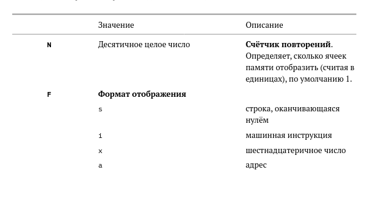{ #fig:001 width=70% }

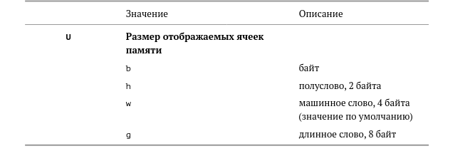{ #fig:002 width=70% }

Например, x/4uh 0x63450 — это запрос на вывод четырёх полуслов (h) из памяти в формате
беззнаковых десятичных целых (u), начиная с адреса 0x63450.
Чтобы посмотреть значения регистров используется команда print /F <val> (сокращен-
но p). Перед именем регистра обязательно ставится префикс $. Например, команда p/x $ecx
выводит значение регистра в шестнадцатеричном формате.
Изменить значение для регистра или ячейки памяти можно с помощью команды set,
задав ей в качестве аргумента имя регистра или адрес. При этом перед именем регистра
ставится префикс $, а перед адресом нужно указать в фигурных скобках тип данных (размер
сохраняемого значения; в качестве типа данных можно использовать типы языка Си).
Справку о любой команде gdb можно получить, введя

(gdb) help [имя_команды]

Понятие подпрограммы
Подпрограмма — это, как правило, функционально законченный участок кода, который
можно многократно вызывать из разных мест программы. В отличие от простых переходов
из подпрограмм существует возврат на команду, следующую за вызовом.
Если в программе встречается одинаковый участок кода, его можно оформить в виде
подпрограммы, а во всех нужных местах поставить её вызов. При этом подпрограмма бу-
дет содержаться в коде в одном экземпляре, что позволит уменьшить размер кода всей
программы.

Инструкция call и инструкция ret
Для вызова подпрограммы из основной программы используется инструкция call, кото-
рая заносит адрес следующей инструкции в стек и загружает в регистр eip адрес соответству-
ющей подпрограммы, осуществляя таким образом переход. Затем начинается выполнение
подпрограммы, которая, в свою очередь, также может содержать подпрограммы.
Подпрограмма завершается инструкцией ret, которая извлекает из стека адрес, занесён-
ный туда соответствующей инструкцией call, и заносит его в eip. После этого выполнение
основной программы возобновится с инструкции, следующей за инструкцией call.

Подпрограмма может вызываться как из внешнего файла, так и быть частью основной
программы.
Основные моменты выполнения подпрограммы иллюстрируются на рис. 9.1.

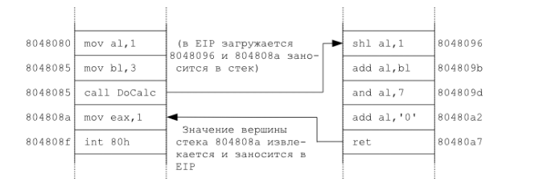{ #fig:003 width=70% }

Важно помнить, что если в подпрограмме занести что-то в стек и не извлечь, то на вершине
стека окажется не адрес возврата и это приведёт к ошибке выхода из подпрограммы. Кроме
того, надо помнить, что подпрограмма без команды возврата не вернётся в точку вызова, а
будет выполнять следующий за подпрограммой код, как будто он является её продолжением.

# Выполнение лабораторной работы

## Реализация программ в NASM

Создал каталог для выполнения лабораторной работы № 9, перешел в него и создал файл lab09-1.asm.Ввел туда программу с листинга 9.1 и запустил ее.

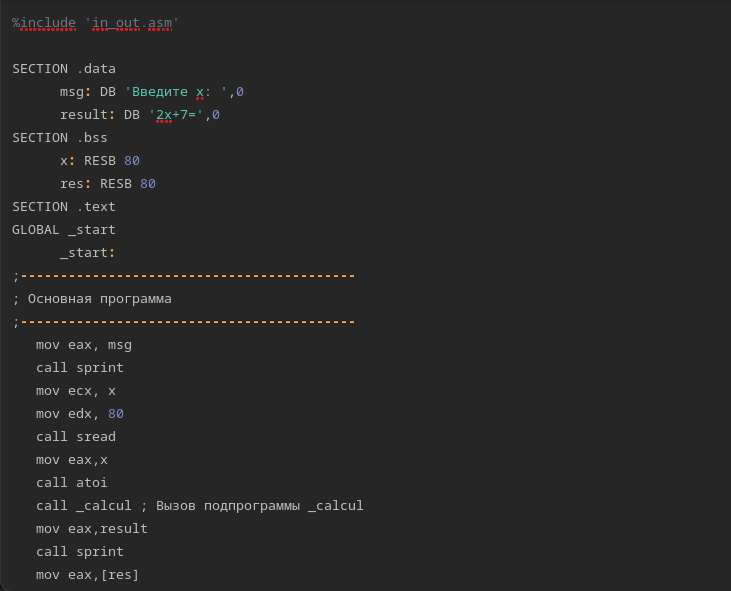{ #fig:004 width=70% }

Программа действительно работает верно

{ #fig:005 width=70% }

## Отладка программам с помощью GDB

Создаю файл lab09-2.asm с текстом программы из листинга 9.2

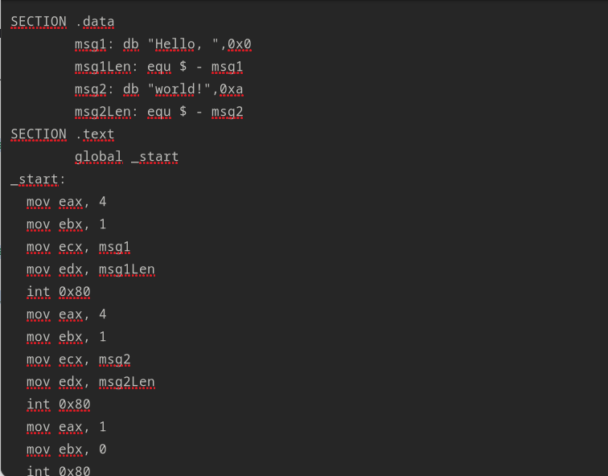{ #fig:006 width=70% }

Получаю исполняемый файл. Для работы с GDB в исполняемый файл добавляю
отладочную информацию, для этого трансляцию программ провожу с ключом
‘-g’.

{ #fig:007 width=70% }

Загружаю исполняемый файл в отладчик gdb

{ #fig:008 width=70% }

Для более подробного анализа программы установливаю брейкпоинт на метку _start, с
которой начинается выполнение любой ассемблерной программы, и запускаю её.

{ #fig:009 width=70% }

Просматриваю дисассимилированный код программы с помощью команды disassemble
начиная с метки _start

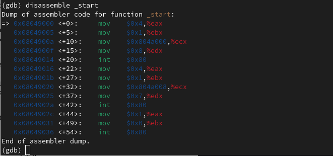{ #fig:010 width=70% }

Переключяюсь на отображение команд с Intel’овским синтаксисом, введя команду set
disassembly-flavor intel

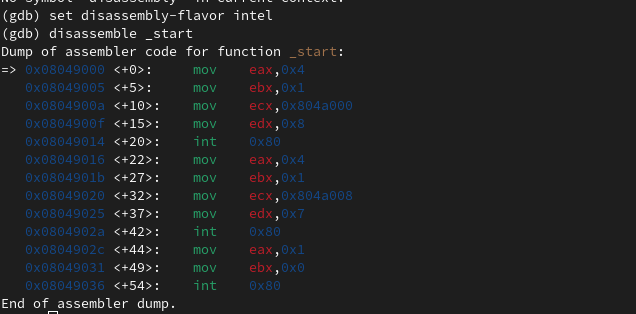{ #fig:011 width=70% }

Перечислил различия отображения синтаксиса машинных команд в режимах ATT и Intel.
Включил режим псевдографики для более удобного анализа программы

{ #fig:012 width=70% }

На предыдущих шагах была установлена точка останова по имени метки (_start). Про-
веряю это с помощью команды info breakpoints 

{ #fig:013 width=70% }

Установил еще одну точку останова по адресу инструкции. Адрес инструкции можно
Определил адрес предпоследней инструкции (mov ebx,0x0) и установил точку останова.
Посмотрел информацию о всех установленных точках останова

{ #fig:014 width=70% }

## Работа с данными программы в GDB

Выполнил 5 инструкций с помощью команды si и проследил за изменением
значений регистров

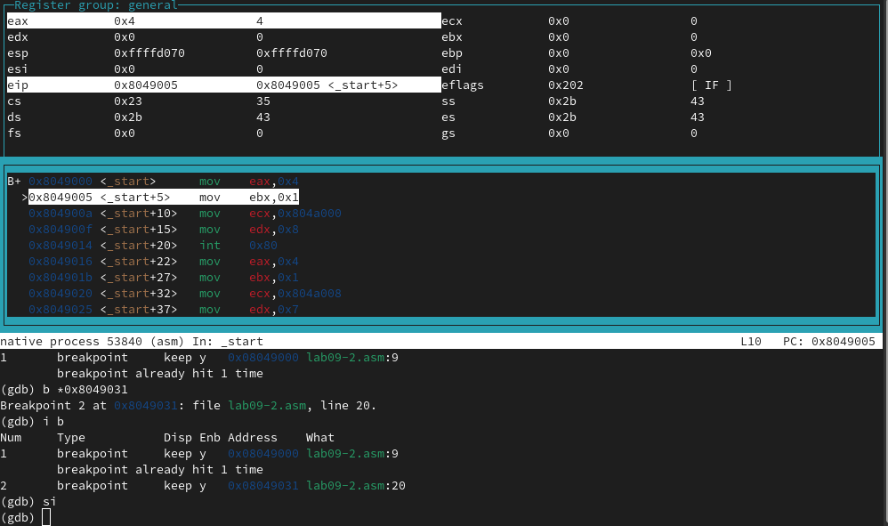{ #fig:015 width=70% }
изменяются следующие регистры:
    ECX: уменьшается при pop ecx и dec ecx.
    EDX: изменяется при pop edx.
    EAX: изменяется при pop eax, call atoi (где функция записывает результат в eax), и при выполнении арифметических операций (imul, sub).
    ESI: изменяется при сложении в add esi, eax

Посмотрел значение переменной msg1 по имени

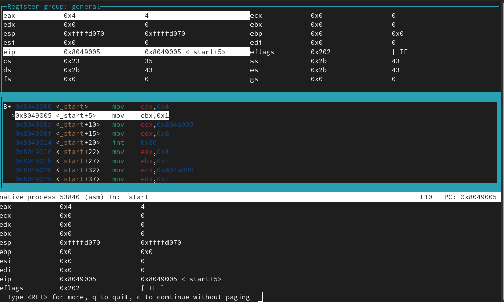{ #fig:016 width=70% }

Посмотрел значение переменной msg2 по адресу. 

{ #fig:017 width=70% }

Изменил первый символ переменной msg1 

{ #fig:018 width=70% }

{ #fig:019 width=70% }

Заменяю первый символ в переменной msg2

{ #fig:020 width=70% }

С помощью команды set измените значение регистра ebx:

{ #fig:021 width=70% }

{ #fig:022 width=70% }

Разница заключается в интерпретации значения регистра: p $ebx выводит его как число, а p/s $ebx трактует его как указатель на строку.

## Обработка аргументов командной строки в GDB

Копирую файл lab8-2.asm, созданный при выполнении лабораторной работы №8,
с программой выводящей на экран аргументы командной строки (Листинг 8.2) в файл с
именем lab09-3.asm.Создаю исполняемый файл.

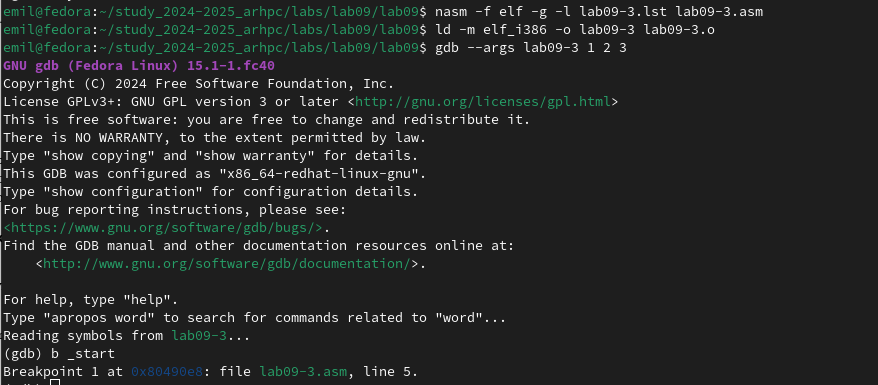{ #fig:023 width=70% }

Устанавливаю точку останова и запускаю программу.

{ #fig:024 width=70% }

Адрес вершины стека храниться в регистре esp и по этому адресу располагается число
равное количеству аргументов командной строки,число аргументов равно 5

{ #fig:025 width=70% }

Посмотрел остальные позиции стека 

{ #fig:026 width=70% }

Шаг изменения адреса равен 4 байта ([esp+4], [esp+8], [esp+12] и т.д.) потому, что каждая ячейка стека занимает 4 байта. Это связано с тем, что программа работает в 32-битной архитектуре, где один элемент типа int или указатель занимает 4 байта в памяти.

# Выполнение заданий для самостоятельной работы

Копирую файл lab8-4.asm, переименовываю в lab09-4.asm, реализовываю вычисление функции как подпрограмму 

{ #fig:027 width=70% }

Проверил работу программы,программа работает корректно

{ #fig:028 width=70% }

Создаю файл с именем lab09-5.asm,при помощи отладчика GDB устраняю ошибку,теперь программа работает корректно.

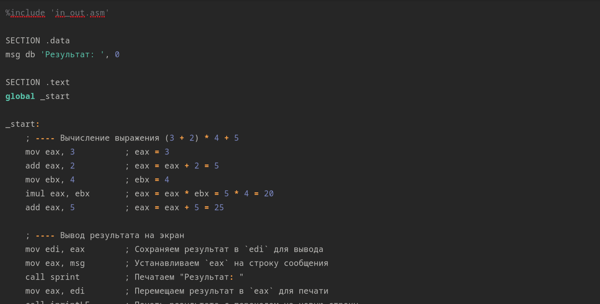{ #fig:029 width=70% }

{ #fig:030 width=70% }

# Выводы

я приобрел навыки написания программ с использованием подпрограмм. Познакомился
с методами отладки при помощи GDB и его основными возможностями
